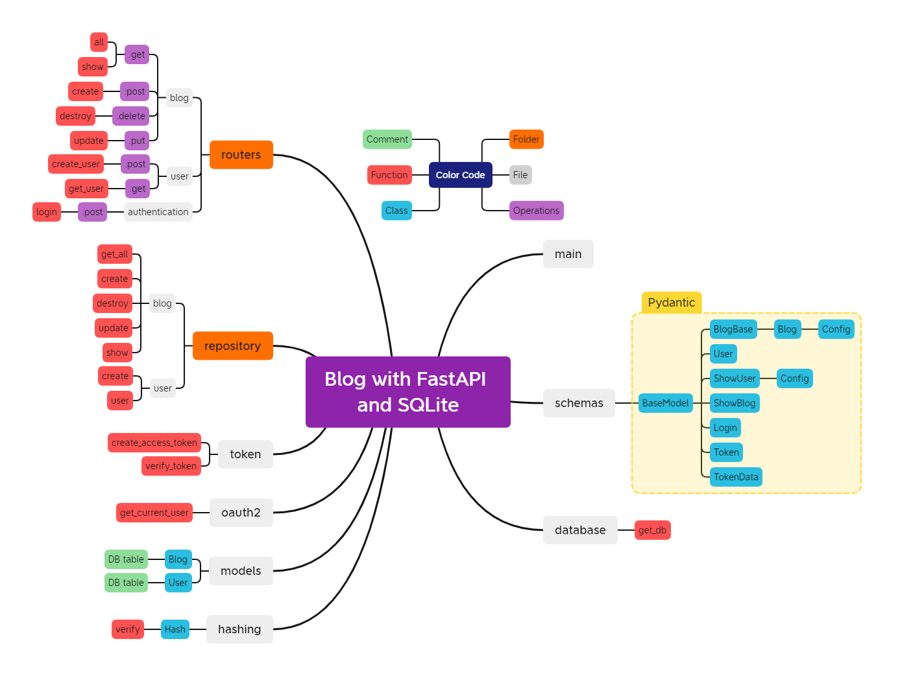

# fastapi-blog
A blog with FastAPI.

Credit goes to https://www.youtube.com/watch?v=7t2alSnE2-I&t=5870s by [@Bitfumes](https://github.com/bitfumes).

## ✨ Features

- Python 3
- FastAPI
- Pydantic
- SQLite
- SQLAlchemy

## 💁‍♀️ How to use

- Clone locally and install packages with Pip using `pip install -r requirements.txt`
- Run locally using `uvicorn blog.main:app --reload`

## 📝 Notes

- To learn about how to use FastAPI with most of its features, you can visit the [FastAPI Documentation](https://fastapi.tiangolo.com/tutorial/).
- FastAPI provides automatic documentation to call and test your API directly from the browser. You can access it at `/docs` with [Swagger](https://github.com/swagger-api/swagger-ui) or at `/redoc` with [Redoc](https://github.com/Rebilly/ReDoc).

## 🖼 Architecture Visualization
 The Mind Map of the app that I made for better understanding of the architecture and later reference for myself:

